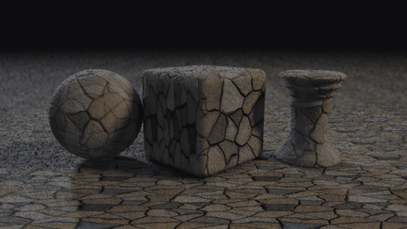

# Tool-MaterialMaker-MCP — 0.8.0a1

Make editable procedural materials in **Material Workshop**, then refine the real
`.ptex` node graph in Material Maker or use the exported textures in your engine.
The browser and your AI assistant share saved projects, controls, versions and builds.
The cookbook is 71 materials across 12 categories.

This is an alpha. Browser workflows and portable contracts have been exercised;
native baking has been checked on one prepared macOS setup at 128 and 256 pixels.
See [current verification](docs/upgrade/TESTING.md).

## Start Workshop

Install Python 3.10 or newer, then open the launcher in this source checkout:

- **macOS:** double-click `Play.command`.
- **Windows:** double-click `play.bat`.
- **Linux:** run `python3 scripts/launch.py`.

The launcher prepares runtime dependencies and opens your browser. Launching again
reopens the same running workspace. Keep its terminal open while using Workshop.

In **Setup & repair**, find or enter your Godot executable and compatible Material
Maker source folder, save them, and choose **Test a small render**. Setup can open
before the native tools are installed. The [setup guide](docs/upgrade/SETUP.md)
includes download links, manual installation, saved settings and repair steps.

## Make something

1. Search the recipe library or choose a category. Open a material to create an
   editable project and start a small preview when rendering is configured.
2. Adjust its numbers, sliders, colors or gradient stops. Changes save automatically.
3. Choose numeric ranges and locks, then build a seeded family of variations.
   Inspect candidates, compare pinned images, and open a favorite with its exact controls.
4. Save a named version or personal recipe. Download the completed build's textures,
   editable `.ptex` source and target import notes together.

Library images come from verified completed builds. Browsing never starts a mass
render, and unbuilt recipes show an explicit placeholder. Follow the
[Workshop walkthrough](docs/upgrade/WORKSHOP.md) for projects, variations, snapshots,
comparison and export. [View the library](docs/upgrade/evidence/workshop-cookbook.png).

## Cookbook and authoring references

The expanded [cookbook](cookbook/README.md) includes editable graphs and recipe
cards. Upstream's gallery shows the materials on a sphere, rounded cube and chess
rook under moving light; these are upstream examples, separate from this fork's
local acceptance evidence.

| Cobblestone | Crystal |
|:--:|:--:|
|  |  |

Use the [authoring guide](docs/AUTHORING.md),
[noise vocabulary](docs/AUTHORING.md#noise-vocabulary-reach-past-voronoi--perlin),
and [debug swatches](docs/DEBUG_SWATCHES.md) to choose building blocks and inspect
individual nodes. The `render_preview_sweep` batch tool previews baked maps with
moving light when a static image leaves their relief unclear.

## Use with an assistant

The server exposes 33 shared material tools, 11 batch tools, and 8 live tools.
Configure your MCP host to launch `mm-mcp` from the installed Python environment.
Use the same working folder or `MM_WORKSPACE_DIR` as Workshop to share projects.
The [tool reference](docs/upgrade/TOOLS.md) and [workflows](docs/upgrade/WORKFLOWS.md)
describe authoring, jobs, variations and exact-build downloads.

The optional [Blender companion](docs/upgrade/BLENDER.md) inspects admitted static
GLB meshes, previews exact Workshop builds, and bakes portable PBR maps and packed
assets. An operator enables it with `MM_BLENDER_BINARY`; the default is disabled.

Builds record their exact graph, inputs, source dependencies and target. Downloads
use immutable build IDs. Workspace edits use revisions and retry keys. Native editor
writes and new custom shaders remain disabled by default. Native baking requires a
working desktop graphics context; Godot's `--headless` dummy renderer cannot bake maps.

## Development and current limits

Continue development on `integration/next`. The fork's `main` remains the branch for
focused upstream contributions. Current upstream changes are integrated here;
see the [upstream contribution record](docs/upgrade/UPSTREAM.md).
No alpha release is published by this workflow.

Install the development extras in your environment, then run the portable gate:

```bash
python -m pip install -e '.[dev,release]'
python scripts/check_release.py -m 'not browser and not native' -rs
python scripts/build_distribution.py
```

See [TESTING](docs/upgrade/TESTING.md) for browser and native acceptance. The
prepared native profile has passed sand baking at 128 and 256 pixels, with
editable-source reopening and Godot imports checked at 128 pixels. Broader recipe/device coverage and native
editor writes still need acceptance. Browser screenshots made with test images
establish UI behavior separately from native material appearance.

| Guide | Purpose |
| --- | --- |
| [Setup & repair](docs/upgrade/SETUP.md) | Launch, connect native tools and repair paths. |
| [Workshop](docs/upgrade/WORKSHOP.md) | Browse, edit, vary, save and export. |
| [Migration](docs/upgrade/MIGRATION.md) | Upgrade from 0.7 and preserve existing work. |
| [Architecture](docs/upgrade/ARCHITECTURE.md) | Shared state, builds and native boundaries. |
| [Security](docs/upgrade/SECURITY.md) | Local authentication, code approval and path policy. |
| [Status](docs/upgrade/STATUS.md) | Exercised capabilities and remaining work. |
| [Integration record](docs/upgrade/INTEGRATION.md) | Archive provenance, changes and verification. |
| [Developer handoff](HANDOFF.md) | Current branch and next practical work. |

For changed behavior, `docs/upgrade/` supersedes older documentation. The
[original README](docs/upgrade/README-0.7.0.md) and historical evidence remain available.

## License and provenance

The original MIT license and attribution are preserved. Cookbook and vendor files
retain their notices. MaterialPilot source code is not copied into this implementation.
The uploaded baseline was `b41b65c612557a7da35a045091199058c0f76abb`; the retained
Material Maker compatibility pin is `ad19fcf0ee34a7caf74df709dc4de7112f0d467d`.
Godot and Material Maker are installed separately. See [PROVENANCE](docs/upgrade/PROVENANCE.md).

## Vector Studio in Foundry

Foundry's canvas workspace supports general icons, props and illustrations through
`vector_author` with `request.profile="vector-document-v2"`. Create a blank document,
start from a template, or supply a complete bounded document. Browser and AI share
the same named parts, paths, groups, palette, protection, revision checks and history.
Reusable components/styles, recipe adapters, automatic rigid-part rig suggestions
and editable clips share these same revision guards. Frozen exports contain SVG,
editable source and optional motion sheets/timing. Original v1 documents upgrade
explicitly; their old exports remain unchanged. The plant workspace stays available.

An optional host Codex CLI provider supports in-page AI proposals. Configure
`MM_VECTOR_AI_BINARY` and `MM_VECTOR_AI_MODEL` together, with optional
`MM_VECTOR_AI_EFFORT=low|medium|high` (default low). Use the host account's saved
Codex login. Runs ignore user config/rules, disable tools, use a temporary read-only
working directory, and require explicit acceptance of the validated candidate.
No provider credentials go to the browser. See the command reference for limits.

See [the shared vector commands](docs/upgrade/TOOLS.md#general-vector-documents).

### Existing plant recipes

The companion's **Vector plants** workspace uses Workshop's persistent project
transactions and a pinned RAI compiler. `vector_author` gives AI the same plant
controls, protected revisions, seeded variations, comparisons, SVG motion
previews, named versions and exact frozen exports. This plant-only workflow is
available without a Material Maker render configuration. See the
[plant operations](docs/upgrade/TOOLS.md#vector_author).
